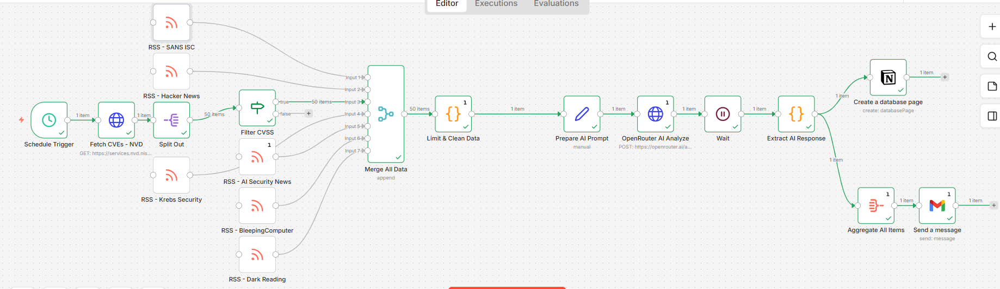
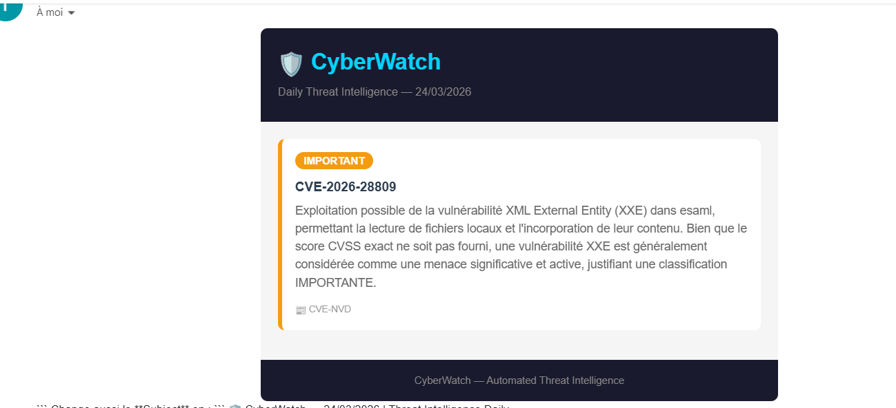
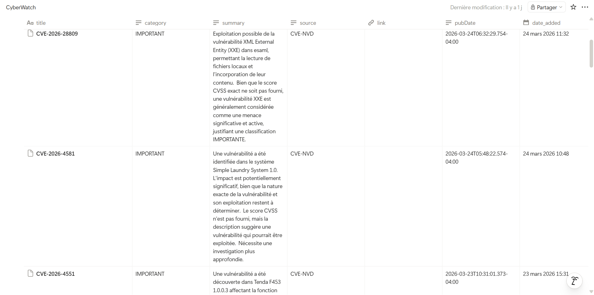

# 🛡️ CyberWatch — Cybersecurity Threat Intelligence Automation

Cybersecurity data is scattered across multiple sources (CVE feeds, news, alerts), making it difficult to monitor manually.

CyberWatch is an automated threat intelligence system built with n8n that collects, analyzes, and reports threats daily using APIs, RSS feeds, and AI.

---

## 🚀 Features

* Fetches CVEs from NVD API (NIST)
* Reads 6 cybersecurity RSS feeds
* Filters high-risk vulnerabilities (CVSS > 7)
* AI-powered threat analysis, summarization, and classification
* Stores structured results in Notion database
* Sends a daily email digest

---

## 🧠 Classification

* 🔴 CRITICAL — Active exploitation, CVSS ≥ 9, zero-days
* 🟠 IMPORTANT — High severity CVEs, significant risks
* 🔵 INFORMATIONAL — Patches, research, general security news

---

## 🛠️ Tech Stack

* n8n (workflow automation, self-hosted via Docker)
* AI via OpenRouter (Google Gemma 3)
* Notion API
* Gmail API
* Docker (Windows)
* NVD NIST API

---

## 📰 Data Sources

* CVE data from NVD (NIST)
* RSS feeds:

  * The Hacker News
  * Krebs on Security
  * SANS Internet Storm Center
  * AI Security News
  * BleepingComputer
  * Dark Reading

---

## 🧠 Architecture

```
Schedule Trigger (daily)
        ↓
Fetch CVEs (NVD API) + RSS feeds
        ↓
Merge + Deduplicate + Clean
        ↓
Filter CVSS > 7
        ↓
Split In Batches (1 item at a time)
        ↓
AI Analysis (OpenRouter)
        ↓
Store in Notion
        ↓
Aggregate Results
        ↓
Send Email Digest
```

---

## 💡 What I Learned

* Designing data pipelines using n8n
* Integrating AI into automation workflows
* Handling API rate limits and execution flow
* Structuring and cleaning real-world data
* Building end-to-end automated systems

---

## 📸 Screenshots

### Workflow



### Email Report



### Notion Database



---

🚀 This is my first project using n8n, focused on automation, AI integration, and cybersecurity threat monitoring.
